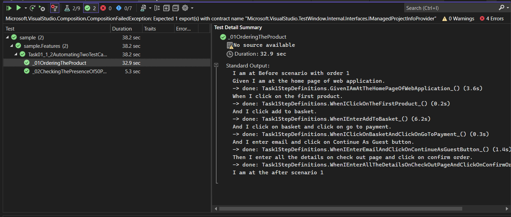
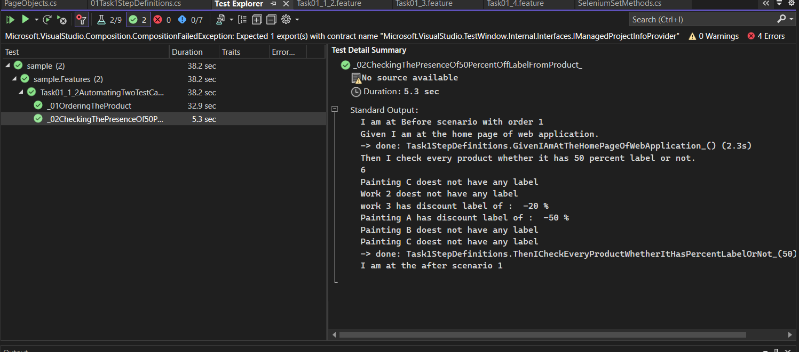
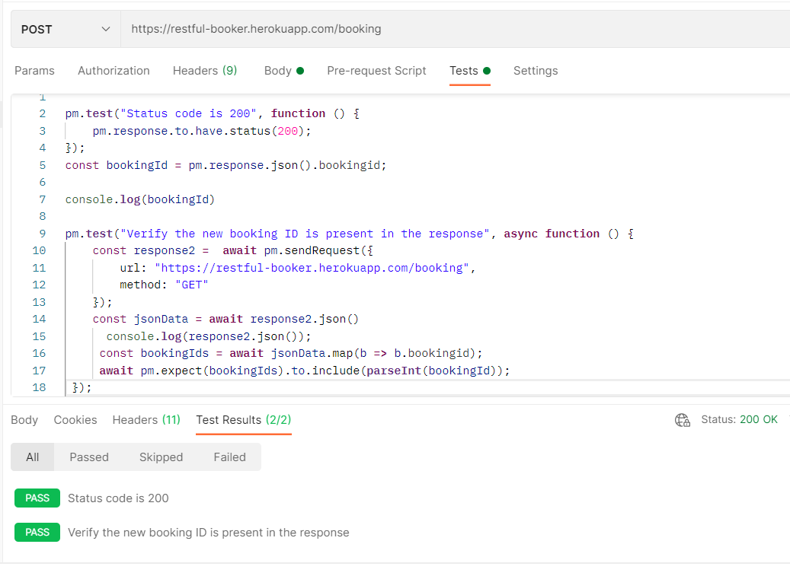

# Next-Basket
Test project for the Test Automation role at Next Basker
## Task 1:
You can find that in the Task_01 folder. There are four parts of this task. First two parts are automated and you can find
these scenarios in Task_01_1_2.feature file. There are other files which are used for automation. In step definition folder, you can find Task01StepDefinition.cs file. This file contains the step definitions or code of both of the scenarios of Task_01_1_2 file.

Moreover, I followed Page Object Model. You can find the pageobjects.cs file in the Support folder. Other than than, there are other files where different selenium based utility methods are written in order to avaoid repetition of work. 

### How to run this task?
        Open the Next.sln file.
        Click on the test button.
        Click on "clear all test results" (optional).
        Click on Test Explorer.
        Click on "not test runs" blue button.
        Right click on the file "Task 01_1_2 : Automating two test cases" and run it.
        You will get the result of both test scenarios of that file
        You can see the results as below:
        
        

# Task 2
    Open the collection in Postman.
    Go to the POST-Create-Booking file.
    Open the Test tab, you will find the code which is verifying that the id of the new booking is present in the response of GetBookingIds and also verifying the status code as well.

    FOr reference, you can see the following image:
    
    
    
